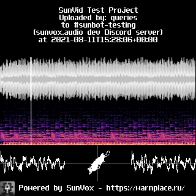

# SunVid

SunVid creates mp4 files from [SunVox](https://warmplace.ru/soft/sunvox/) projects.

Click the image below to play a sample video:

[](sunvid-test-project.mp4)

# You Can Join This Server has sunvid compatible with sunbot

[](https://discord.gg/2wVhZJjYTv)


## Prerequisites

Prerequisites:

- Python 3.9
- Poetry
- ImageMagick

### ImageMagick configuration

MoviePy (one of SunVid's dependencies) uses the `/tmp` directory
to pass files to/from ImageMagick.

On some systems, you may need to edit `/etc/ImageMagick-6/policy.xml`
and add these lines to the end, just above `</policymap>`.
You will likely need to use `sudo` to gain administrator privileges to do so.

```
  <!-- in order to allow MoviePy to render text -->
  <policy domain="path" rights="read" pattern="@/tmp/tmp*.txt" />
  <policy domain="path" rights="write" pattern="@/tmp/tmp*.png" />
```

## Install steps

1. `git clone https://github.com/metrasynth/sunvid`
2. `cd sunvid`
3. `poetry install`
4. `poetry run python -m sunvid --version`

# Running SunVid

The main command is `render`. Get help with its options using:

    poetry run python -m sunvid render --help

Example usage:

    poetry run python -m sunvid render --overwrite sunvid-test-project.sunvox
